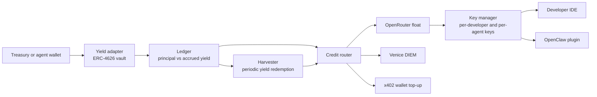

# Architecture

_Source: [`../sources/yield-to-inference-2026-09-24.md`](../sources/yield-to-inference-2026-09-24.md). Math: [`../engine/ledger.ts`](../engine/ledger.ts)._

---

## Five modules

Yield adapter, ledger, harvester, credit router, key manager. **The yield side and the credit side connect only through the ledger**, so each rail can be swapped independently.

Arrows carry information as well as money. **The core loop: raise each key's limit by the yield the ledger has computed.**

1. **Yield adapter.** The user deposits USDC or ETH into a standard ERC-4626 vault. The standard makes Morpho, Aave and Yearn interchangeable behind one interface.
2. **Ledger.** Records each user's principal and vault shares. Accrued yield is `convertToAssets(shares) − principal`.
3. **Harvester.** Yield does not need to be redeemed every time. The ledger opens credit against accrued yield first, and actual redemption settles in a batch, weekly for example. This saves gas and rail fees.
4. **Credit router.** Decides which inference rail receives the settled USDC. For the hackathon, one OpenRouter float is enough.
5. **Key manager.** Issues a key per developer or agent and syncs the ledger's yield balance to each key's spend limit.

**Settled for the hackathon:** if credit already spent exceeds yield not yet harvested when principal is withdrawn, do we deduct the difference from principal, or only ever open the limit up to earned yield? **The latter.** `creditLimit` in the kernel implements it, and a vault loss floors accrued yield at zero rather than going negative.

---

## Plug-in yield modules

One fits the structure almost exactly. **Octant v2's Yield Donating Strategy (YDS)** is an ERC-4626 vault that keeps principal with the user and automatically routes all yield on-chain to a designated address. Point that address at our credit router and "only the interest becomes AI credit" is done at the contract level.

| Module | Form | Can yield be split off? | Hackathon fit | Notes |
|---|---|---|---|---|
| [Octant v2 YDS](https://docs.v2.octant.build/docs/yield_donating_strategy/) | ERC-4626 vault framework | Yes, all yield to a designated address | High | Gitcoin runs its matching pool on YDS over Morpho Steakhouse USDC ([Gitcoin](https://gitcoin.co/case-studies/from-one-off-rounds-to-ongoing-impact-gitcoin-s-new-sustainable-funding-model)). Spearbit audit |
| [Morpho Vaults + SDK](https://docs.morpho.org/developers/earn/get-started/) | Direct vault integration, TS SDK, reference app | Computed in our own ledger | Fastest | Base OnchainKit has an Earn component that attaches in a few lines ([Morpho](https://morpho.org/blog/onchainkit-earn-integrate-morpho-vaults-in-minutes/)) |
| [Kiln DeFi](https://docs.api.kiln.fi/docs/kiln-defi-quick-start) | White-label ERC-4626 vaults, API, widget | Yes, partner fee applied to yield on-chain | Medium, needs partner onboarding | Engine behind Safe wallet's Earn. Good fit if ICP1 treasuries use Safe ([Kiln](https://www.kiln.fi/post/safe-wallet-x-kiln-defi-one-click-stablecoin-yield-for-multisig-treasuries)) |
| [Yield.xyz](https://docs.turnkey.com/cookbook/yieldxyz) (formerly StakeKit) | Single API that builds transactions to sign | Computed in our own ledger | Medium, needs API key | Staking, lending and vaults on 75+ networks. Publishes an OpenClaw skill ([GitHub](https://github.com/stakekit/)) |
| [Aave Earn Vaults](https://aave.com/docs/developers/aave-vaults) | Deploy ERC-4626 vaults | Yes, via manager fee | Medium | Vault manager takes a fee from yield |
| [CDP USDC Rewards](https://docs.cdp.coinbase.com/embedded-wallets/usdc-rewards) | Hold USDC in a wallet, earn rewards | No, paid weekly to the developer's Coinbase account | Low | Zero integration, but US residents and entities only |

**Recommended combination.**
- **Hackathon:** Morpho vault directly plus an off-chain ledger. Fastest to run.
- **Pitch:** show Octant YDS as the target architecture, to prove "principal never leaves the customer's wallet."
- **Commercial, ICP1:** a partner vault with institutional compliance already in place, like Kiln, persuades treasuries faster.

ETH and SOL staking yield plugs into the same structure. Yield.xyz covers staking through one API, so it is the expansion path when a treasury's asset is not USDC.

---

## Credit rails

Key issuance is solved by OpenRouter. **The one blocked segment is putting USDC into credit automatically.** OpenRouter deprecated its programmatic crypto top-up API ([OpenRouter](https://openrouter.ai/docs/cookbook/administration/crypto-api)), and Auto Top-Up runs only on a saved card ([OpenRouter support](https://openrouter.zendesk.com/hc/en-us/articles/51680638594331-How-does-Auto-Top-Up-work-and-how-do-I-turn-it-on-or-off)).

| Rail | Top-up automated | Key issuance | Resale allowed | Models |
|---|---|---|---|---|
| OpenRouter + manual USDC top-up | No, web checkout | Management API: per-key limits and reset periods | Forbidden under standard terms | 400+ |
| OpenRouter + crypto card Auto Top-Up | Yes, USDC-loaded card saved as the card | Same | Forbidden under standard terms | 400+ |
| [Venice](https://docs.venice.ai/overview/vvv-diem) DIEM | Yes, on-chain staking is the top-up | Web3 key-generation API, per-key daily limits | Venice publicly mentions agents reselling capacity | Venice's models |
| [Orbio](https://www.orbio.so/protocol) CREDIT | Yes, on-chain `buyAndActivate` | Orbio gateway key | The seller market is itself resale | Via OpenRouter |
| x402 gateway | Yes, USDC per request | No key; the wallet authenticates | N/A | Varies by gateway |

**Hackathon: OpenRouter float.** Pre-fund our account, raise key limits by accrued yield, and top up manually each week with the harvested USDC. Fees run about 5% for crypto and 5.5% for card ([RouterPlex](https://routerplex.com/blog/openrouter-top-up-fees)).

**Automation path 1: crypto card.** Load harvested USDC onto a crypto card and attach it to OpenRouter Auto Top-Up. The human step disappears. Crypto developers already use this workaround ([SolCard](https://www.solcard.cc/blog/pay-openrouter-with-crypto)).

**Automation path 2: on-chain rails.** Venice DIEM and Orbio CREDIT top up on-chain, so the loop closes in contracts. The cost is narrower model coverage and liquidity than OpenRouter. For ICP2 agents, an x402 gateway is also a natural fit.

**Make the credit router rail-agnostic** and the demo can show "the same yield can go to OpenRouter, Venice or x402." That becomes the product's moat.
