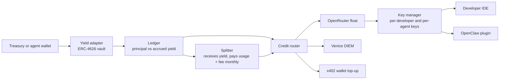

# Architecture

_Source: [`../sources/yield-to-inference-2026-09-24.md`](../sources/yield-to-inference-2026-09-24.md). Math: [`../engine/ledger.ts`](../engine/ledger.ts)._

---

## Five modules

Yield adapter, ledger, Splitter, credit router, key manager. **The yield side and the credit side connect only through the ledger**, so each rail can be swapped independently.

Arrows carry information as well as money. **The core loop: raise each key's limit by the yield the ledger has computed.**

1. **Yield adapter.** The user deposits USDC or ETH into a standard ERC-4626 vault. The standard makes Morpho, Aave and Yearn interchangeable behind one interface.
2. **Ledger.** Records each user's principal and vault shares. Accrued yield is `convertToAssets(shares) − principal`.
3. **Splitter** (was harvester). Yield is not redeemed per request. The ledger opens credit against accrued yield first, and redemption settles in a batch each period. It redeems only `usage + fee`; the rest of the leftover yield stays in the vault and becomes principal. See `settle` in the kernel.
4. **Credit router.** Decides which inference rail receives the usage USDC. For the hackathon, one OpenRouter float is enough.
5. **Key manager.** Issues a key per developer or agent and syncs the ledger's yield balance to each key's spend limit.

**Decided: keys are OpenRouter Management API keys, not our own proxy.** For the hackathon they do everything a proxy would: per-key limits, per-key usage, 400+ models. A proxy is less than a day of work, but it adds metering, streaming and failure handling that OpenRouter already does. Build it when supply moves to contracted providers and `base_url` changes anyway.

**Settled:** the limit only ever opens up to earned yield, and spend never draws from principal. `creditLimit` in the kernel implements it. **Open:** if the vault loses value after credits were spent but before settlement, who covers the difference. The kernel floors yield at zero and stops new spend; the rest waits until the workflow is final.

---

## Custody

**Decided 2026-09-25:** one Octant YDS vault per customer, shares in the customer's wallet, yield minted to our Splitter. Full mechanism, guarantees and fallback in [`06-workflow.md`](06-workflow.md).

---

## Plug-in yield modules

One fits the structure closely. **Octant v2's Yield Donating Strategy (YDS)** is a single-strategy ERC-4626 vault that deploys one asset into an external yield source and routes **all realized profit** to one configured donation address ([Octant docs](https://docs.octant.app/docs/developers/yield_donating_strategy/)). How it works ([introduction](https://docs.octant.app/docs/developers/yield_donating_strategy/introduction-to-yds/)):

- Depositors get principal-tracking shares: **profit never raises their price per share**
- A keeper calls `report()`. On profit, new shares are **minted to the donation address**. On loss, donation shares are **burned first**, and only a loss larger than that buffer lowers depositors' price per share
- Depositors withdraw principal any time through standard ERC-4626 calls, with no involvement from the donation address
- **One donation address per vault.** Per-customer attribution means one vault per customer

Point the donation address at a small contract of ours and "only the interest becomes AI credit" is enforced at the vault level, with principal shares sitting in the customer's own wallet. [`06-workflow.md`](06-workflow.md) option 1D works this through.

| Module | Form | Can yield be split off? | Hackathon fit | Notes |
|---|---|---|---|---|
| [Octant v2 YDS](https://docs.octant.app/docs/developers/yield_donating_strategy/) | ERC-4626 vault framework, deployed per strategy | Yes, profit minted as shares to one donation address at `report()` | High, if its contracts deploy on the target chain | Gitcoin runs its matching pool on YDS over Morpho Steakhouse USDC ([Gitcoin](https://gitcoin.co/case-studies/from-one-off-rounds-to-ongoing-impact-gitcoin-s-new-sustainable-funding-model)). Spearbit audit |
| [Morpho Vaults + SDK](https://docs.morpho.org/developers/earn/get-started/) | Direct vault integration, TS SDK, reference app | Computed in our own ledger | Fastest | Base OnchainKit has an Earn component that attaches in a few lines ([Morpho](https://morpho.org/blog/onchainkit-earn-integrate-morpho-vaults-in-minutes/)) |
| [Kiln DeFi](https://docs.api.kiln.fi/docs/kiln-defi-quick-start) | White-label ERC-4626 vaults, API, widget | Yes, partner fee applied to yield on-chain | Medium, needs partner onboarding | Engine behind Safe wallet's Earn. Good fit if ICP1 treasuries use Safe ([Kiln](https://www.kiln.fi/post/safe-wallet-x-kiln-defi-one-click-stablecoin-yield-for-multisig-treasuries)) |
| [Yield.xyz](https://docs.turnkey.com/cookbook/yieldxyz) (formerly StakeKit) | Single API that builds transactions to sign | Computed in our own ledger | Medium, needs API key | Staking, lending and vaults on 75+ networks. Publishes an OpenClaw skill ([GitHub](https://github.com/stakekit/)) |
| [Aave Earn Vaults](https://aave.com/docs/developers/aave-vaults) | Deploy ERC-4626 vaults | Yes, via manager fee | Medium | Vault manager takes a fee from yield |
| [CDP USDC Rewards](https://docs.cdp.coinbase.com/embedded-wallets/usdc-rewards) | Hold USDC in a wallet, earn rewards | No, paid weekly to the developer's Coinbase account | Low | Zero integration, but US residents and entities only |

**Recommended combination.**
- **Hackathon:** Morpho vault directly plus an off-chain ledger. Fastest to run.
- **Pitch:** show Octant YDS as the target architecture, to prove "principal never leaves the customer's wallet."
- **Commercial, ICP1:** a partner vault with institutional compliance already in place, like Kiln, persuades treasuries faster.

ETH and SOL staking yield plugs into the same structure. Yield.xyz covers staking through one API, so it is the expansion path when a treasury's asset is not USDC.

---

## Credit rails

Key issuance is solved by OpenRouter. **The one blocked segment is putting USDC into credit automatically.** OpenRouter deprecated its programmatic crypto top-up API ([OpenRouter](https://openrouter.ai/docs/cookbook/administration/crypto-api)), and Auto Top-Up runs only on a saved card ([OpenRouter support](https://openrouter.zendesk.com/hc/en-us/articles/51680638594331-How-does-Auto-Top-Up-work-and-how-do-I-turn-it-on-or-off)).

| Rail | Top-up automated | Key issuance | Resale allowed | Models |
|---|---|---|---|---|
| OpenRouter + manual USDC top-up | No, web checkout | Management API: per-key limits and reset periods | Forbidden under standard terms | 400+ |
| OpenRouter + crypto card Auto Top-Up | Yes, USDC-loaded card saved as the card | Same | Forbidden under standard terms | 400+ |
| [Venice](https://docs.venice.ai/overview/vvv-diem) DIEM | Yes, on-chain staking is the top-up | Web3 key-generation API, per-key daily limits | Venice publicly mentions agents reselling capacity | Venice's models |
| [Orbio](https://www.orbio.so/protocol) CREDIT | Yes, on-chain `buyAndActivate` | Orbio gateway key | The seller market is itself resale | Via OpenRouter |
| x402 gateway | Yes, USDC per request | No key; the wallet authenticates | N/A | Varies by gateway |

**Decided supply path.** Hackathon: our OpenRouter account, resold through per-key limits, the way Orbio does it. Real product: contract providers to run open-weight models for us, the way Touchmark does it.

**Hackathon: OpenRouter float.** Pre-fund our account, raise key limits by accrued yield, and top up once a month with the usage USDC.

### Funding the float: getting USDC into OpenRouter

OpenRouter charges **5.5% ($0.80 minimum) on card purchases and 5% on crypto**, passes provider prices through with no markup, may expire credits a year after purchase, and refunds only within 24 hours ([OpenRouter FAQ](https://openrouter.ai/docs/faq)).

| # | Path | Cost on $1 of credit | Automated | Effort | Fit |
|---|---|---|---|---|---|
| 1 | **USDC through the web checkout, once a month** | 5% | No: one person, one checkout, monthly | None | **Hackathon.** Monthly settlement means one top-up a month |
| 2 | **Enterprise contract, pay the invoice by wire** after off-ramping USDC | fee set in the order form; off-ramp about 0 to 1% | Mostly: off-ramp and wire can be scripted | Sales process, minimum spend | **Real product.** Invoiced after usage, so no prefunded float, and the enterprise terms permit serving end customers |
| 3 | USDC-loaded card saved for Auto Top-Up | 5.5% plus card load fees | Yes | Card issuer onboarding for a business | Bridge between 1 and 2 if manual top-ups hurt |
| 4 | Switch rail: Venice x402 top-up, Orbio `buyAndActivate`, x402 gateway | Venice at list; Orbio at a discount; x402 per request | Yes, on-chain | Different catalog; x402 needs our proxy | See below |
| 5 | Script the web checkout with a headless browser | 5% | Yes | Fragile | **No.** Breaks on any UI change and invites an account ban |

BYOK does not solve funding but cuts cost: our own provider keys run through OpenRouter with no fee up to $25,000 of list-price usage a month ($200,000 on enterprise), 5% above that. It only helps once we pay providers directly, which is the contracted-supply stage anyway.

**Switching rail changes what we are.** With Venice we issue Venice keys (it has per-key epoch limits and accepts USDC via `POST /x402/top-up`), so no proxy, but the catalog is Venice's, mostly open-weight. With Orbio we would resell a reseller of OpenRouter. With an x402 gateway there are no keys to issue: either we run a proxy that pays per request from our wallet (reversing decision 5), or, for ICP2, **we skip keys and send the yield straight to the agent's own x402 wallet**, which is the cleanest agent story of all.

**Make the credit router rail-agnostic** and the demo can show "the same yield can go to OpenRouter, Venice or x402." That becomes the product's moat.
