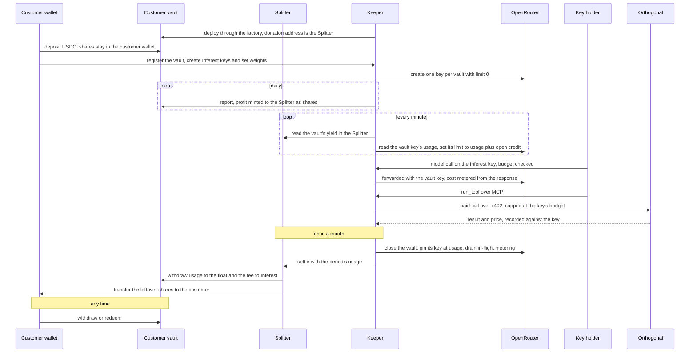

# Workflow

_Decided 2026-09-25 and built. Math: [`../engine/ledger.ts`](../engine/ledger.ts) and [`../app/limits.ts`](../app/limits.ts). Contracts: [`../contracts/src`](../contracts/src). Keeper: [`../app/keeper.ts`](../app/keeper.ts). Paid tools: [`../app/tools.ts`](../app/tools.ts)._

This is the chain-agnostic mechanism: who sends which transaction, when, and what each party can and cannot do. A deployment differs only in chain, USDC address and yield source, all of which live in one config file per chain (`config/arbitrum-one.json`).

---

## Summary

1. Each customer gets **their own Octant yield-donating vault**, deployed by our factory over an allowlisted ERC-4626 yield source. They deposit USDC and **keep the vault shares in their own wallet**.
2. The vault's donation address is our **Splitter**. When our keeper calls `report()`, the vault's profit is minted to the Splitter as vault shares. That is the customer's yield, now out of their position and in one place.
3. The customer's admin creates keys and gives each a **weight**. Our proxy lets each Inferest key spend its weight's share of the yield **already in the Splitter**, and our keeper holds the vault's single OpenRouter key at that same total as a backstop, so every dollar of credit is backed before it is spent.
4. Agents and developers can also buy **paid tools** through our MCP server. Each call is paid in USDC over x402 from our wallet, capped at the key's remaining budget, and recorded against the key like model spend.
5. Once a month the Splitter settles: `usage` to our float, **10% of the leftover** to us, and the leftover shares **back to the customer's wallet** as new principal.
6. The customer withdraws principal any time through the standard ERC-4626 `withdraw`. We are not involved.

**Trust in one line:** we can only ever spend yield already sitting in the Splitter, and only to two addresses fixed at deploy. Principal is in the customer's wallet the whole time.

---

## Actors

| Actor | What it is | Can do |
|---|---|---|
| **Customer** | Treasury wallet or Safe (ICP1), or an agent's wallet (ICP2) | Deposit, withdraw, create keys, set key weights. Holds the vault's **management** role, signs in on the dashboard through Dynamic (email code or the treasury wallet) and manages the vault their wallet created |
| **Key holders** | Developers or agents | Call models with their Inferest key through our proxy, call paid tools with the same key over our MCP server. Nothing on-chain |
| **Customer vault** | Octant `ERC4626Strategy` over an allowlisted yield source, one per customer | Earns yield, mints profit to the Splitter on `report()`, burns Splitter shares first on a loss |
| **Factory** | Our contract, one per chain, owned by us | Deploys customer vaults, keeps the allowlist of yield sources, records which customer owns which vault |
| **Splitter** | Our contract, one per chain, immutable. The donation address of every customer vault | Holds each customer's reported yield as that vault's shares, settles monthly |
| **Keeper** | Our worker's signing key (`app/keeper.ts`) | Calls `report()` on customer vaults and `settle()` on the Splitter, holds each vault's OpenRouter key limit at its open credit. Nothing else on-chain |
| **OpenRouter** | Our account, prefunded float, one key per vault | Serves the model requests our proxy forwards; its per-vault limit is the backstop |
| **Orthogonal** | Paid tool catalog (search, scraping, enrichment) | Answers each tool call with a price, has its payment facilitator verify and settle the x402 payment, runs the tool |
| **Inferest MCP server** | Part of our HTTP server (`/mcp`) | Authenticates the key, searches the catalog, pays for and runs tools within the key's budget |

Each customer vault is its own ERC-20 share token, so the Splitter's balance of vault X's shares is exactly customer X's unsettled yield. One Splitter serves every customer with no internal ledger.

---

## Lifecycle



### 1. Onboard

Our factory deploys an Octant `ERC4626Strategy` for the customer over an allowlisted yield source, with `donationAddress = Splitter`, `keeper = our worker`, and the customer as pending management. The customer accepts management, approves USDC and calls `deposit`. Shares land in their wallet. The customer then registers the vault with our server, which checks with the factory that the vault is one of ours before it will issue keys for it. The customer registers the vault from a dashboard session whose wallet created it, or we register it with the operator token; either way the vault's admin is the wallet that created it.

**Why the customer holds management:** the only lever over yield is the donation address, and changing it takes a two-step process with a **14-day cooldown** during which depositors can exit. If the customer points it elsewhere, they have simply left Inferest; we lose nothing, because we only ever spend yield already in the Splitter. Emergency functions move funds from the yield source back into the vault, never out.

**Why an allowlist:** anyone can call the factory, so a fake ERC-4626 could otherwise report yield that does not exist and we would open limits against it. The factory refuses any target the owner has not allowlisted, and the server refuses to register a vault the factory did not create.

### 2. Keys

In the dashboard the vault's admin (the login whose verified wallet created the vault, or the operator) creates keys and sets a weight per key (default 1). The login's wallets are verified from Dynamic's token on our server, looking the wallets up from Dynamic when the token carries only credential hashes. A key is an Inferest secret (`sk-inf-...`) shown once and stored as a hash; the admin can rotate it (new secret, same budget and history) or revoke it (next request gets 401). Developers use it as the API key of any OpenAI-compatible client with the base URL set to the Inferest server, and as the bearer for the MCP tools server.

Behind every vault sits one OpenRouter key, minted when the vault is registered and stored encrypted. The proxy forwards each call with that key; the keeper holds its limit at the vault's open credit as a backstop, so a proxy bug cannot spend past yield.

### 3. Report, meter and sync

**Daily**, the keeper calls `report()` on each customer vault. Profit since the last report is minted to the Splitter as vault shares.

**Per call**, the proxy reads the key's remaining budget from the store, refuses with 402 when nothing is left, forwards the request with the vault's OpenRouter key, and records the cost from the response (the usage event of a stream, the usage object otherwise) as one `model_calls` row. A call whose cost never arrives is filed pending and resolved by the keeper through OpenRouter's generation lookup.

**Every minute**, per customer:

```
credit_i     = yieldInSplitter × (1 − railFee) × weight_i / Σ weights        (a revoked key weighs 0)
spent_i      = modelCost_i + toolSpend_i × (1 − railFee)                       (this period's rows)
remaining_i  = max(credit_i − spent_i, 0), scaled down if Σ remaining would exceed credit − Σ spent
companyLimit = usage_OR + Σ remaining_i                                          (OpenRouter limits are cumulative)
```

A key's credit is fixed by its weight, so what one key leaves unused does not flow to the others. The proxy enforces `remaining_i` before every call; each request in flight may overshoot by its own cost, so the overshoot is bounded by concurrency times the cost of one call. The company limit is the backstop, one keeper tick behind. Once a day the keeper logs the drift between OpenRouter's cumulative usage and the recorded model cost, and, beside it, the recorded cost no settlement has billed yet. While a call's cost is still pending (its usage event never reached the proxy), the company limit is held where it is: OpenRouter's usage already includes that call and our spend does not, so raising the limit by the open credit would double its headroom until the keeper resolves the cost.

**Loss pending:** if the yield source is worth less than the vault last reported, the proxy refuses the vault's keys with 402 and the keeper pins the company key's limit at its usage, until the next `report()` books the loss.

**Stale budget:** the proxy refuses a vault's keys with 503 when the keeper has not synced that vault for ten minutes, so an RPC outage stops opening credit instead of serving against yield the keeper can no longer see.

### 4. Paid tools

The key holder adds our MCP endpoint (`/mcp`, bearer token is the key secret) and gets three tools: `search_tools`, `tool_details` (free, returns the exact parameters and price) and `run_tool`. LLM calls go through the same server on the same key, at `/v1/chat/completions`.

For `run_tool`, the server:

1. Refuses before anything is signed when the key has no tool budget left. The budget is the key's remaining credit, shared with model spend under the same weight.
2. Makes one paid request to Orthogonal over x402 (protocol version 2, USDC on Base). The payment cap handed to the x402 client is the key's remaining budget; a price above it is refused before signing. Concurrent calls on one key reserve budget so they cannot overspend together.
3. Records the price against the key when the payment was signed. A payment the processor rejects costs nothing and is not recorded. A call that fails after payment is recorded and reported to the agent with the amount, so the agent checks usage before retrying. Nothing is ever retried automatically.

Tools carry no rail fee, because they are paid in USDC directly. At settlement, `usage` = model credits / (1 − railFee) + tool spend.

### 5. Settle (monthly)

Settlement is the only time yield leaves the Splitter. The keeper:

1. Marks the vault as settling, so the proxy answers its keys with 503 (retry later), and pins the vault's OpenRouter key limit at its current usage, so nothing new can land either way.
2. Waits up to ten seconds for requests already past the budget check to finish metering, then reads this period's rows, re-reading until no new row landed meanwhile, or gives up and retries later, so a settlement started from the CLI beside a running server cannot miss a call: `usage = Σ modelCost / (1 − railFee) + Σ toolSpend`.
3. Signs the `Splitter.settle(vault, usage)` transaction locally and writes a pending settlement record (vault, usage, each key's spend snapshot, transaction hash) before broadcasting. The record is insert-only, so two processes cannot both broadcast for one vault.
4. Broadcasts, then polls for the receipt. On success it records the settlement, starts the new period (spend is per period, so this is a bump), moving any call metered after the snapshot into it so it is billed next month, clears the settling flag, marks the month, and re-syncs the backstop, all in one database transaction. On a revert it drops the record and reopens the vault.
5. If the receipt does not arrive, the record stays, the vault stays closed, and every tick reconciles it until it mines. A transaction the node no longer knows after 30 minutes is dropped so the vault can retry. An operator can clear a stuck record through the admin API.
6. Each vault carries the month it last settled. A vault whose settlement failed is retried on later ticks in the same month, with a ten-minute backoff after a failed attempt.

On-chain:

```
y        = convertToAssets(splitter's shares of vault)
paid     = min(usage, y)
leftover = y − paid
fee      = feeBps × leftover                              (feeBps = 1000)
withdraw paid to FLOAT address, fee to FEE address        (both immutable)
transfer the remaining shares, worth leftover − fee, to the customer
```

The leftover shares land in the customer's wallet, where they are principal. This is the kernel's `settle`: principal grows by `leftover − fee`. Because limits never open beyond `y`, `usage ≤ y` always holds and nothing is ever owed; if usage were ever reported above `y`, the contract pays `y` and emits the shortfall.

In the demos settlement is triggered by hand. The `settle` command asks the running server to do it, so the drain and the snapshot happen where the requests are; only when no server answers does it settle in its own process. In production the keeper settles each vault on the first tick of a new month and keeps retrying within the month until it succeeds.

### 6. Withdraw

Standard ERC-4626 `withdraw` or `redeem` from the customer's own wallet, any time. Yield already reported sits in the Splitter and is settled on the normal schedule; yield accrued since the last report stays in the vault and is reported on the next `report()` against the remaining shares.

### 7. Vault loss

On a loss, `report()` **burns the Splitter's shares of that vault first**. So unsettled yield is the first-loss buffer, and principal is only hit by a loss larger than that buffer. Limits shrink with the Splitter balance on the next sync, and the loss-pending freeze above stops spend against yield that is already gone before the loss is booked.

---

## What the contracts enforce

| Guarantee | Enforced by |
|---|---|
| Principal stays in the customer's wallet | Vault shares are held by the customer; profit never raises their price per share |
| Only yield reaches us | Only profit is minted to the Splitter; the Splitter can only withdraw against its own shares |
| Only vetted yield sources | `createVault` reverts for a target not on the owner's allowlist |
| We take at most the yield, and at most the deployed fee share of what the customer did not use | `paid = min(usage, y)`, fee computed on-chain from the leftover; `feeBps` is fixed at deploy (1000, or 10%, today) and the contract refuses anything above 20% |
| Yield we take goes only to our two addresses | `floatAddress`, `feeAddress` immutable in the Splitter |
| Only our keeper can settle, and only vaults from our factory | `NotKeeper`, `UnknownVault` |
| We cannot trap funds | Withdrawal is standard ERC-4626 and needs nothing from us |
| We are never owed money | Limits open only up to yield already in the Splitter |
| **Not enforced:** that reported usage is honest | Usage is our own metering of OpenRouter responses and Orthogonal payments. Bounded by yield in the Splitter. The customer can check it against per-key usage on the dashboard |

### What the keeper enforces

| Rule | Where |
|---|---|
| A limit never opens ahead of yield in the Splitter, including after reweighting | `computeLimits` in `app/limits.ts` |
| Keys are refused while a loss is unreported: the proxy answers the vault's keys with 402 and the keeper pins the vault's OpenRouter key limit at its usage until the next report books the loss | `checkBudget` in `app/proxy.ts`, `syncVault` in `app/keeper.ts` |
| Settlement closes the vault, drains, snapshots, then settles: the proxy answers 503 while the vault is settling, the keeper waits for in-flight metering, and any call metered after the snapshot is moved into the next period, so nothing spent is left unbilled | `settleVault` in `app/keeper.ts`, `completePendingSettlement` in `app/store.ts` |
| A settlement is broadcast once and its bookkeeping applied exactly once, even across a crash, an RPC failure, or a second process | pending settlement record written before broadcast, reconciled by transaction hash, `app/keeper.ts` and `app/store.ts` |
| A vault the server does not track is never settled | `settleVault`, `POST /api/admin/settle` |
| Overlapping ticks and duplicate settlements of one vault are skipped | in-flight guards in `app/keeper.ts` |
| Tool payments are capped at the key's budget before signing, never retried, and rejected payments are not charged | `toolGateway`, `x402PayingFetch` in `app/tools.ts` |
| Every mutating API route needs a session that owns the vault or the operator token; state is scoped to the caller | `resolveCaller`, `vaultFor` in `app/server.ts`; `app/auth.ts` |
| On a real chain an owner may trigger report once an hour and settle once a day per vault; the operator is unlimited; demo chains have no limit | `ownerCooldown` in `app/server.ts`; `app/cooldown.ts` |

### Contract interfaces

```solidity
// Splitter: immutables registry, keeper, floatAddress, feeAddress, feeBps (MAX_FEE_BPS = 2000)
function yieldOf(address vault) external view returns (uint256);            // convertToAssets(balanceOf(vault shares))
function settle(address vault, uint256 usage) external
    returns (uint256 paid, uint256 fee, uint256 returnedShares);              // onlyKeeper, nonReentrant
event Settled(address indexed vault, address indexed customer, uint256 yieldAssets,
    uint256 paid, uint256 fee, uint256 returnedShares, uint256 shortfall);

// VaultFactory: immutables splitter, tokenizedStrategy, keeper, emergencyAdmin; owner sets the allowlist
function setAllowedTarget(address target, bool allowed) external;           // onlyOwner
function createVault(address target, string name, string symbol) external returns (address vault);
function customerOf(address vault) external view returns (address);         // zero for a vault we did not deploy
function vaultsOf(address customer) external view returns (address[] memory);
event VaultCreated(address indexed customer, address indexed vault, address indexed target);
```

---

## Deployment

- **Any EVM chain.** The Octant strategy takes its `TokenizedStrategy` implementation address as a constructor argument, so our deploy script deploys the implementation, the Splitter and the factory together and nothing depends on a pre-existing Octant deployment. Built with Solidity 0.8.33 and `evm_version = cancun`; Octant v2 core is pinned by commit.
- **Yield source per chain.** `ERC4626Strategy` wraps any ERC-4626 vault. The Arbitrum One config points at **Fluid USDC** (`0x1A996cb54bb95462040408C06122D45D6Cdb6096`), chosen for native yield of about 4% on tens of millions of TVL and a rate model that holds on a fork. Morpho vaults use an adaptive rate that decays over a six-month time warp with no borrow activity, which understates their live yield in a demo; their live rate is similar.
- **Deploy script** writes `contracts/deployments/<chainId>.json`, which the app reads. The app refuses a deployment whose chain id or target differs from the chain config.
- **Fork test** (`contracts/test/Fork.t.sol`) runs the full cycle against the live Fluid vault when an Arbitrum One RPC is set.
- **Demos** run on a Tenderly Virtual TestNet or a local anvil fork of Arbitrum One; the demo helpers support both. A virtual testnet must keep chain id 42161.
- **License:** the Splitter only calls the vault through its interface, so it is not a derivative of the AGPL code. The factory imports Octant and is AGPL.

---

## Decisions

The full decision table is in the [README](../README.md#decisions). What this workflow depends on:

1. **Custody:** one Octant yield-donating vault per customer, donation address is the Splitter, shares in the customer's wallet. The cap on what we can take is structural: only profit reaches the Splitter.
2. **Splitting yield across keys:** admin-set weights, default equal. Unused credit on one key does not flow to another until the admin changes weights.
3. **Cadence:** `report()` daily, limit sync every minute, `settle()` monthly. The kernel has no notion of period length, so this is configuration.
4. **Leftover yield:** returned to the customer as vault shares, which is principal, so it compounds.
5. **Paid tools:** Orthogonal, through our MCP server, paid per call over x402 from our wallet. One server-side catalog with a price on every response, which fits a service paying on behalf of many customers.
6. **Rail fee:** absorbed in this build (`HACKATHON_PARAMS`, `railFee = 0`). One USDC of yield opens one dollar of credit; buying that credit costs us about 5% more, paid from the fee address. Our result per settlement is `10% × leftover − 5% × usage`, negative once a customer uses more than two thirds of its yield (pinned in `ledger.test.ts`). For the real product: pass the fee through (`DEFAULT_PARAMS`), absorb it as acquisition cost, or remove it with an enterprise invoice. Tools carry no rail fee either way.
7. **Float top-up:** manual for now. OpenRouter is prefunded by us, settlement sends usage in USDC to our float wallet, and someone buys credit through OpenRouter's checkout; OpenRouter has no crypto purchase API. In production a programmable card funded from the float wallet pays that checkout, or an enterprise invoice removes the float.
8. **Keys:** Inferest keys on our own proxy, in front of one OpenRouter Management API key per vault. LLM calls pass through us for the budget check and the metering; the provider key's limit is the backstop.
9. **Admin identity:** Dynamic login, verified server-side against the environment's JWKS; ownership is the vault's on-chain creator. Multiple admins and Safe treasuries are later.

---

## Demo scripts

_Numbers use `HACKATHON_PARAMS` at 4.5% APY and are pinned in `engine/ledger.test.ts`. The live Fluid vault decides the real figure; at its current rate six months on 100,000 USDC yields about $2,060._

### Treasury (ICP1), `demo/treasury.ts`

1. Finance lead deposits 100,000 USDC into their vault. Shares appear in their wallet.
2. Admin creates three developer keys at equal weight.
3. Warp six months, call `report()`: **$2,225** yield lands in the Splitter and **$2,225** of credit opens, about **$742** per key.
4. Developers call real models on their own keys; say **$500** spent.
5. Settle: **$500** to the float, **$173** fee (10% of the $1,725 left over), **$1,553** of shares back to the customer. Principal is now **$101,553**, still in their wallet.
6. Withdraw **$101,553** straight from the wallet. No request, no wait.

### Agent (ICP2), `demo/agent.ts`

1. An agent's own wallet deposits into its own vault. Same contracts, different depositor.
2. The agent runs with its Inferest key and the Inferest base URL in place of OpenRouter's, plus the Inferest MCP server for tools. The script drives the loop directly; OpenClaw or Hermes work the same way with the key and the MCP URL.
3. Warp, `report()`: the agent's limit rises from its own yield.
4. The agent does a task that needs a model **and** paid tools through Orthogonal. If a tool call is refused, it switches to another tool. The dashboard shows model spend and tool spend drawing from the same yield.
5. Settle: leftover goes back into the agent's vault. **No human topped anything up.**

---

## Known gaps

- **One OpenRouter account.** Every vault's key lives under our account. Per-company isolation would mean one OpenRouter account per company, each with its own float.
- **One admin per vault.** The vault's admin is the login whose verified wallet created it; a company that wants several finance leads, or a Safe multisig as its treasury, needs named co-admins and an EIP-1271 signature path. Both are next.
- **Orthogonal descriptions.** Coinbase's facilitator rejects a payment whose echoed resource description is longer than about 255 characters; our client caps it before signing. Any other client hits the same on long-description listings.
- **A daily report on an emptied vault fails Octant's health check.** Harmless, logged, and skipped until the vault is funded again.

---

## Out of scope

- Usage verification on-chain (bounded by the Splitter balance instead)
- Multiple vaults per customer, cross-chain positions
- Upgradeability. The Splitter is immutable; a new version is a new deployment
