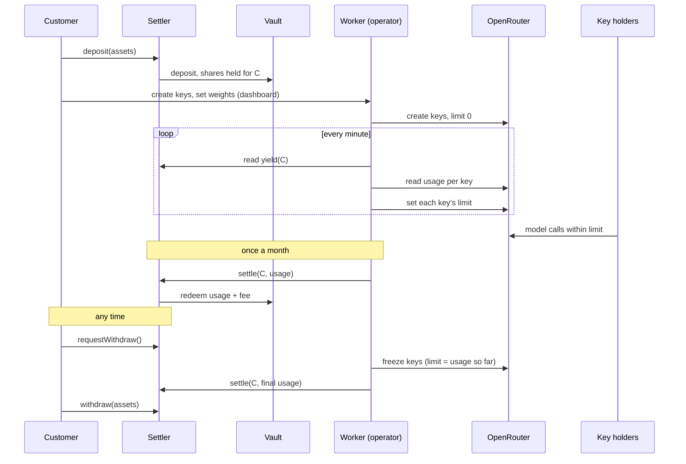

# Workflow

_**Draft, 2026-09-25.** Six open choices are marked **Recommended**, with the alternatives next to them. Nothing here is final until each is picked. Math: [`../engine/ledger.ts`](../engine/ledger.ts)._

This is the chain-agnostic mechanism: who sends which transaction, when, and what each party can and cannot do. Deployments differ only in chain, USDC address and vault address.

---

## Summary

1. The customer deposits USDC through the **Settler** contract, which puts it in an ERC-4626 vault and holds the shares **in the customer's name**.
2. The customer's admin creates keys and gives each a **weight**. Our worker keeps each OpenRouter key's limit at its weight's share of unspent yield.
3. Once a month our operator calls `settle(account, usage)`. The contract takes `usage + 10% of leftover` from yield and **cannot take more than yield**. The rest stays as principal.
4. The customer can withdraw at any time: request, keys freeze, final settlement, withdraw. If we do not settle within the window, the customer withdraws anyway.

**Trust in one line:** in the worst case we can take your yield, never your principal, and only to two addresses fixed at deploy.

---

## Actors

| Actor | What it is | Can do |
|---|---|---|
| **Customer** | Treasury wallet or Safe (ICP1), or an agent's wallet (ICP2) | Deposit, request withdrawal, withdraw, set key weights |
| **Key holders** | Developers or agents | Call models with their key, nothing on-chain |
| **Settler** | Our contract, one per chain, immutable | Holds vault shares per customer, enforces the yield cap |
| **Operator** | Our worker's signing key | Call `settle` only |
| **Vault** | Audited ERC-4626 USDC vault | Earns yield |
| **OpenRouter** | Our account, prefunded float | Serves requests, enforces per-key limits |

---

## Lifecycle



### 1. Deposit

The customer approves USDC to the Settler and calls `deposit(assets)`. The Settler deposits into the vault and records `principal[C] += assets`, `shares[C] += minted`. Two transactions for the customer, both from their own wallet or Safe.

### 2. Keys

In the dashboard the admin creates keys and sets a weight per key (default equal, see decision 3). The worker creates matching OpenRouter keys with limit 0 and maps them to the account.

### 3. Accrue and sync

Every minute the worker, per account:

```
yield     = convertToAssets(shares) − principal         (floored at 0)
owed      = unpaid usage carried over from a loss        (decision 6, usually 0)
pool      = yield × (1 − railFee) − spentThisPeriod − owed × (1 − railFee)
limit_i   = usage_i + weight_i × max(pool, 0)            (OpenRouter limits are cumulative)
```

Between syncs a key can overshoot by at most one minute of spend. We absorb that.

### 4. Settle (monthly)

The operator calls `settle(C, usage)` with the month's usage in USDC (credits spent / (1 − railFee), plus any `owed`). The contract:

```
y        = convertToAssets(shares[C]) − principal[C]     (0 if negative)
paid     = min(usage, y)
leftover = y − paid
fee      = feeBps × leftover
redeem paid → FLOAT address, fee → FEE address          (both immutable)
principal[C] += leftover − fee
```

If `usage > y` the difference is not taken; the worker records it as `owed` (decision 6). Calling `settle` again right after finds `y = 0` and moves nothing, so repeated calls cannot extract more than total yield.

### 5. Withdraw (any time)

1. Customer calls `requestWithdraw()`. Event emitted, window starts (decision 2).
2. Worker sees the event and freezes every key at its current usage.
3. Worker calls `settle(C, final usage)`.
4. Customer calls `withdraw(assets)` for up to their position's value (principal, or less after a vault loss), or `withdrawAll()`. Allowed once settled after the request, **or once the window has passed without settlement**, so we cannot hold funds hostage.

### 6. Vault loss

If the vault's share price falls, `yield` is 0 and the keys stop at the next sync. Usage already made that month has no yield to pay from. See decision 6.

---

## Settler interface (sketch)

```solidity
// immutables: asset, vault, operator, floatAddress, feeAddress, feeBps, withdrawWindow
function deposit(uint256 assets) external;
function requestWithdraw() external;
function withdraw(uint256 assets) external;      // after settlement or window
function withdrawAll() external;
function settle(address account, uint256 usage) external onlyOperator;
function yieldOf(address account) external view returns (uint256);
```

What the contract enforces, and so what can be said in the pitch:

| Guarantee | Enforced by |
|---|---|
| Principal can only go back to the customer | `withdraw` is the only path that redeems beyond yield, and it pays `msg.sender`'s own position |
| We take at most the yield | `paid = min(usage, y)`, fee computed on-chain from leftover |
| Yield we take goes only to our two addresses | `floatAddress`, `feeAddress` immutable |
| We cannot trap funds | withdraw opens after the window even if we never settle |
| **Not enforced:** that reported usage is honest | usage is off-chain OpenRouter data. Bounded by yield. Customer can check it against per-key usage on the dashboard |

---

## The six decisions

### 1. The customer revokes access before settlement

We prefund OpenRouter and get paid at month end. Under yesterday's design (shares in the customer's wallet, approved to us) the customer can revoke the approval or move the shares after spending, and we eat the month's usage.

| Option | How | Cost |
|---|---|---|
| **A. Settler holds the shares (Recommended)** | Deposit goes through the Settler; shares leave only via settle (yield) or withdraw (after freeze and settlement) | **Reverses decision #7**: shares are no longer in the customer's own wallet. Replaced by "held by an immutable contract that can only return principal to you." Also solves decisions 2 and 4 |
| B. Keep approval, watch it | Worker watches allowance and balance; on revoke, freezes keys at once; settle daily instead of monthly to shrink exposure | Exposure is still up to a day of usage; daily settlement costs gas; the "principal never moves" claim rests on our off-chain behavior |
| C. Prepay each month | Customer pays expected usage up front | Breaks "pay with yield" |

**Why A:** it is the only option where every promise in the pitch is enforced by code, and Octant YDS, the target architecture in `03-architecture.md`, is the same shape. Our remaining exposure is about one minute of spend.

### 2. Principal withdrawal

| Option | Cost |
|---|---|
| **A. Any time, request then withdraw, 24h window (Recommended)** | Customer waits up to 24h. In the demo, warp through it |
| B. Only at month end | Simpler, but a CFO will not accept locked principal |
| C. Instant, settle inside `withdraw` | Needs usage on-chain at the moment of withdrawal; usage is off-chain, so impossible without trusting a price feed of our own |

### 3. Splitting yield across keys

| Option | Cost |
|---|---|
| **A. Admin-set weights, default equal (Recommended)** | One key's unused share does not flow to others until the admin changes weights. Clean attribution, no overshoot |
| B. Shared pool, every key can draw it all | Better utilization, but between syncs every key can spend the whole pool at once: overshoot up to N times the pool |
| C. Fixed dollar amount per key | Admin has to guess the yield in advance |

### 4. Cap the settler on-chain

| Option | Cost |
|---|---|
| **A. Yes, in the Settler (Recommended)** | About a hundred more lines of Solidity and tests. It is the product's core claim and it is what a contract-quality review looks at |
| B. Off-chain only, plain approval | Faster, but "principal never moves" becomes a promise instead of a property |

Picking 1A makes this automatic.

### 5. Agents in the demo

| Option | Cost |
|---|---|
| **A. One of the three keys is an agent (OpenClaw) (Recommended)** | Shows ICP2 in the same three minutes. An agent depositing from its own wallet is the same contract with a different depositor: say it in the pitch, do not demo it |
| B. Separate agent-wallet flow | A second deposit, a second dashboard view. Does not fit three minutes |
| C. Treasury only | Loses ICP2 entirely |

### 6. Vault loss

Usage already spent in a month when the vault loses value.

| Option | Cost |
|---|---|
| **A. Carry it forward as `owed` (Recommended)** | Next yield pays `owed` first, before any new limit opens. If the customer withdraws while `owed > 0`, we forgive it. Principal is never touched, we carry the risk only if they leave |
| B. We absorb it immediately | Simplest; our loss is at most one month's usage |
| C. Take it from principal | Breaks decision 1 (yield only). Rejected |

The vault loss itself, on principal, is the customer's: it is their principal in an audited vault they chose. Recovery restores principal before new yield counts, because yield is measured above `principal`.

---

## Demo script under the recommendations

1. Finance lead deposits 100,000 USDC through the Settler.
2. Admin creates three keys at equal weight: two developers, one OpenClaw agent.
3. Warp six months: **$2,225** yield, **$2,114** of credit, about **$705** per key.
4. IDE and agent call real models; say **$500** spent.
5. Settle: **$526** to the float, **$170** fee, **$1,529** stays. Principal **$101,529**.
6. Request withdrawal: keys freeze on screen. Warp the window. Withdraw **$101,529** to the customer's wallet.

Step 6 is new: it ends the demo on the money coming back, which is the claim.

---

## Out of scope

- Usage verification on-chain (bounded by the yield cap instead)
- Multiple vaults per customer, cross-chain positions
- Upgradeability. The Settler is immutable; a new version is a new deployment
