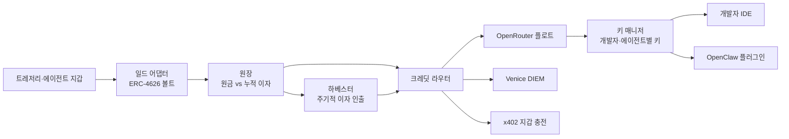

# Yield-to-Inference: 크립토 일드로 LLM 크레딧 결제하기

Sep 24, 2026 · @Moyed

## 한 줄 요약과 문제 정의

원금은 일드 볼트에 묶어두고, 거기서 나오는 이자만 LLM API 크레딧으로 자동 전환해 개발자나 에이전트에게 키 형태로 지급하는 엔진이다. 포지셔닝은 "Use now, pay with yield"에 가깝다.

크립토 트레저리를 가진 조직이 AI 비용을 낼 때 지금은 세 단계를 거친다. 크립토 매도 후 오프램프, 법정화폐 운영비 편성, 카드로 크레딧 충전이다. 이 과정마다 세무 이벤트, 환전 수수료, 결재 지연이 생긴다.

자율 에이전트는 더 막혀 있다. 에이전트는 온체인 지갑은 있지만 카드가 없어서, 사람이 API 키에 크레딧을 대신 넣어줘야 계속 돌아간다.

엔진이 해결하는 것은 두 가지다. 트레저리 자산에서 AI 비용까지 가는 경로를 한 번의 예치로 줄이는 것, 그리고 원금을 건드리지 않고 이자로 비용을 충당하는 것이다.

## ICP 두 개

같은 엔진을 두 번 포장한다. ICP1은 직접 영업하는 B2B, ICP2는 에이전트 플랫폼을 통해 들어가는 B2B2C다.

| 구분 | ICP1: 크립토 트레저리 조직 | ICP2: 에이전트 월렛·파이낸셜 에이전트 팀 |
| --- | --- | --- |
| 예시 | 상장 DAT 기업, 솔라나 같은 재단, 밸리데이터 운영사, 크립토 네이티브 스타트업 | 트레이딩·퍼프 에이전트, 에이전트 월렛 SDK, OpenClaw 같은 에이전트 프레임워크 사용자 |
| 구매자 | CFO, 재무 담당자 | 에이전트 플랫폼 PM, 개발자 |
| 사용자 | 사내 개발자 | 에이전트 자신 |
| 핵심 가치 | 오프램프 없이 트레저리에서 AI 비용 처리, 이자로 비용 상쇄 | 사람 개입 없이 에이전트가 자기 지갑 일드로 추론 비용 자동 충전 |
| 포장 | 대시보드 + 개발자별 API 키 | SDK·플러그인 + 에이전트별 키 |

**ICP1 타이밍이 좋다.** 2026년 초 기준 상장사 200곳 이상이 디지털 자산을 대차대조표에 보유하고, 업계 화두가 단순 매집에서 일드 창출로 옮겨가고 있다([CoinDesk](https://www.coindesk.com/opinion/2026/04/04/digital-asset-treasuries-must-now-earn-their-keep)). "일드를 어디에 쓰는가"에 대한 구체적 답을 주는 셈이다.

**ICP2는 인프라가 이미 깔려 있다.** Coinbase가 2026년 2월 에이전트 전용 지갑을 출시했고 x402 결제와 지출 한도를 기본 제공한다([Coinbase](https://www.coinbase.com/developer-platform/discover/launches/agentic-wallets)). Privy는 Stripe에, Dynamic은 Fireblocks에 인수되는 등 에이전트 월렛 시장이 빠르게 통합 중이다([Crossmint 비교](https://www.crossmint.com/learn/agent-wallets-compared)). 지갑은 있는데 "지갑 돈으로 추론비 내기"는 아직 빈 칸이다.

## 경쟁·레퍼런스 지형

"크립토 자산을 추론 크레딧으로 바꾼다"는 아이디어 자체는 이미 검증되고 있다. 다만 기존 플레이어는 전부 자기 토큰을 재원으로 쓴다. 블루칩 자산의 중립적인 일드(USDC 대출, ETH·SOL 스테이킹)를 재원으로 쓰는 곳은 아직 안 보인다. 이게 우리 차별점이다.

| 서비스 | 재원 | 크레딧 레일 | 우리와의 관계 |
| --- | --- | --- | --- |
| [Venice](https://docs.venice.ai/overview/vvv-diem) (VVV·DIEM) | 자체 토큰 VVV 스테이킹 | 자체 추론, 1 DIEM = 하루 1달러 크레딧 | 가장 가까운 선례. 원금 유지하며 매일 크레딧이 나오는 구조 |
| [Orbio](https://www.orbio.so/protocol) (ORBIO·CREDIT) | 자체 토큰 거래 수수료의 50% | OpenRouter 기반 게이트웨이 | 수수료를 OpenRouter 크레딧으로 바꿔 홀더에게 배분 |
| [Touchmark](https://touchmark.ai/) | 구매자 선불 | 오픈웨이트 모델 제공사 선도계약 | 일드는 아니고, 추론을 금융상품처럼 다루는 인접 사례 |
| x402 추론 게이트웨이 ([BlockRun](https://pypi.org/project/blockrun-llm/), ClawRouter 등) | 에이전트 지갑의 USDC | 요청당 USDC 결제 | ICP2의 대체재이자 잠재적 출력 레일 |
| [OpenRouter](https://openrouter.ai/docs/guides/overview/auth/management-api-keys) | 카드·USDC 선충전 | 400개 이상 모델 라우팅 | 우리가 위에 올라탈 레일 |

**Venice가 핵심 벤치마크다.** VVV를 스테이킹해 DIEM을 민팅하면 DIEM 1개당 매일 1달러 API 크레딧이 영구적으로 나온다([CoinMarketCap](https://coinmarketcap.com/cmc-ai/venice-ai/what-is/)). VVV는 최근 시총 약 15억 달러까지 올랐다([Cryptopolitan](https://www.cryptopolitan.com/venice-vvv-token-hits-record-34-as-its-privacy-ai-staking-model-draws-fresh-bets/)). "원금 묶고 매일 추론 받기"에 시장 수요가 있다는 증거다.

**Orbio는 레일 설계를 참고할 대상이다.** CREDIT 토큰을 온체인에서 사고 activate하면 API 잔액으로 전환되고, 에이전트가 사람 결제 없이 직접 처리할 수 있다([Orbio](https://www.orbio.so/protocol)).

**x402 게이트웨이는 에이전트 쪽 대안이다.** 이미 지갑 서명만으로 80개 이상 모델을 요청당 결제로 쓰는 SDK가 있다([BlockRun](https://pypi.org/project/blockrun-llm/)). 우리는 이들과 경쟁하기보다, 에이전트 지갑의 원금을 볼트에 두고 이자로 x402 결제를 대주는 레이어로 들어가는 게 맞다.

## 엔진 아키텍처

엔진은 다섯 개 모듈로 나뉜다. 일드 어댑터, 원장, 하베스터, 크레딧 라우터, 키 매니저다. 일드 쪽과 크레딧 쪽이 원장 하나로만 연결되기 때문에 양쪽 레일을 독립적으로 바꿔 끼울 수 있다.



실선은 돈이 아니라 정보 흐름까지 포함한다. 원장이 계산한 누적 이자만큼 키 한도를 올리는 게 핵심 루프다.

1. **일드 어댑터**: 사용자가 USDC나 ETH를 예치하면 ERC-4626 표준 볼트에 넣는다. 표준을 쓰면 Morpho, Aave, Yearn 등을 같은 인터페이스로 바꿔 끼울 수 있다.
2. **원장**: 사용자별 원금과 볼트 share를 기록한다. 누적 이자는 `convertToAssets(shares) - 원금`으로 계산한다.
3. **하베스터**: 이자를 매번 인출할 필요는 없다. 원장상 이자만큼 먼저 크레딧 한도를 열어주고, 실제 인출은 주 1회 등 배치로 정산한다. 가스비와 레일 수수료를 아끼는 설계다.
4. **크레딧 라우터**: 정산된 USDC를 어떤 추론 레일로 보낼지 결정한다. 해커톤은 OpenRouter 플로트 하나로 충분하다.
5. **키 매니저**: 개발자나 에이전트마다 키를 발급하고, 원장이 계산한 이자 잔액을 키의 지출 한도로 동기화한다.

**설계 결정 하나가 남는다.** 원금 인출 시 이미 쓴 크레딧이 아직 정산 안 된 이자보다 크면 차액을 원금에서 차감할지, 한도를 이자 확정분까지만 열지 정해야 한다. 해커톤은 후자가 안전하다.

## 플러그앤플레이 일드 모듈

있다. 그리고 우리 구조에 거의 그대로 맞는 게 하나 있다. Octant v2의 Yield Donating Strategy(YDS)는 원금은 사용자에게 두고 발생한 이자 전부를 지정한 주소로 온체인에서 자동 라우팅하는 ERC-4626 볼트다. 그 주소를 우리 크레딧 라우터로 지정하면 "이자만 AI 크레딧으로"가 컨트랙트 레벨에서 끝난다.

| 모듈 | 형태 | 이자를 따로 뗄 수 있나 | 해커톤 적합도 | 비고 |
| --- | --- | --- | --- | --- |
| [Octant v2 YDS](https://docs.v2.octant.build/docs/yield_donating_strategy/) | ERC-4626 볼트 프레임워크 | 예, 이자 전부를 지정 주소로 | 높음 | Gitcoin이 트레저리를 Morpho Steakhouse USDC 위 YDS에 넣고 이자로 매칭풀을 운영 중([Gitcoin](https://gitcoin.co/case-studies/from-one-off-rounds-to-ongoing-impact-gitcoin-s-new-sustainable-funding-model)). Spearbit 감사 |
| [Morpho Vaults + SDK](https://docs.morpho.org/developers/earn/get-started/) | 볼트 직접 연동, TS SDK, 레퍼런스 앱 | 직접 원장으로 계산 | 가장 빠름 | Base OnchainKit에 Earn 컴포넌트가 있어 몇 줄로 붙임([Morpho](https://morpho.org/blog/onchainkit-earn-integrate-morpho-vaults-in-minutes/)) |
| [Kiln DeFi](https://docs.api.kiln.fi/docs/kiln-defi-quick-start) | 화이트라벨 ERC-4626 볼트 + API + 위젯 | 예, 이자에 파트너 수수료를 온체인 적용 | 중간, 파트너 온보딩 필요 | Safe 월렛 Earn 기능의 엔진. ICP1 트레저리가 Safe를 쓰면 궁합이 좋음([Kiln](https://www.kiln.fi/post/safe-wallet-x-kiln-defi-one-click-stablecoin-yield-for-multisig-treasuries)) |
| [Yield.xyz](https://docs.turnkey.com/cookbook/yieldxyz) (구 StakeKit) | 단일 API, 서명할 트랜잭션을 만들어줌 | 직접 원장으로 계산 | 중간, API 키 필요 | 75개 이상 네트워크의 스테이킹·대출·볼트를 한 API로. OpenClaw 스킬까지 공개([GitHub](https://github.com/stakekit/)) |
| [Aave Earn Vaults](https://aave.com/docs/developers/aave-vaults) | ERC-4626 볼트 배포 | 예, 매니저 수수료로 | 중간 | 볼트 매니저가 이자에서 수수료를 떼는 구조 |
| [CDP USDC Rewards](https://docs.cdp.coinbase.com/embedded-wallets/usdc-rewards) | 지갑에 USDC만 두면 보상 | 아니오, 개발자 코인베이스 계정으로 주간 지급 | 낮음 | 연동은 0이지만 미국 거주자·법인 한정 |

**추천 조합.** 해커톤은 Morpho 볼트 직접 연동 + 오프체인 원장으로 가장 빨리 돌린다. 피치에서는 "원금은 고객 지갑에서 한 번도 안 움직인다"를 보여주기 위해 Octant YDS 구조를 목표 아키텍처로 제시한다. 사업화 단계에서 ICP1 트레저리 대상으로는 Kiln처럼 이미 기관 컴플라이언스를 갖춘 파트너 볼트가 설득에 유리하다.

ETH·SOL 스테이킹 일드도 같은 구조로 붙는다. Yield.xyz가 스테이킹까지 한 API로 커버하므로 트레저리 자산이 USDC가 아닐 때의 확장 경로로 둔다.

## LLM 크레딧 레일 옵션

키 발급은 OpenRouter로 이미 해결되고, 막히는 곳은 "USDC를 자동으로 크레딧에 넣는 구간" 하나다. OpenRouter의 프로그래밍 방식 크립토 충전 API는 폐기됐고([OpenRouter](https://openrouter.ai/docs/cookbook/administration/crypto-api)), 자동 충전(Auto Top-Up)은 저장된 카드로만 돈다([OpenRouter 지원](https://openrouter.zendesk.com/hc/en-us/articles/51680638594331-How-does-Auto-Top-Up-work-and-how-do-I-turn-it-on-or-off)).

| 레일 | 충전 자동화 | 키 발급 | 재판매 허용 | 모델 범위 |
| --- | --- | --- | --- | --- |
| OpenRouter + 수동 USDC 충전 | 아니오, 웹 체크아웃 | Management API로 키별 한도·주기 리셋 | 일반 약관상 금지 | 400개 이상 |
| OpenRouter + 크립토 카드 Auto Top-Up | 예, USDC 충전식 카드를 저장 카드로 | 동일 | 일반 약관상 금지 | 400개 이상 |
| [Venice](https://docs.venice.ai/overview/vvv-diem) DIEM | 예, 온체인 스테이킹이 곧 충전 | 웹3 방식 키 생성 API, 키별 일일 한도 | Venice가 에이전트의 용량 재판매를 공개적으로 언급 | Venice 지원 모델 |
| [Orbio](https://www.orbio.so/protocol) CREDIT | 예, 온체인 `buyAndActivate` | Orbio 게이트웨이 키 | 판매자 마켓 자체가 재판매 구조 | OpenRouter 경유 |
| x402 게이트웨이 | 예, 요청마다 USDC 결제 | 키 없음, 지갑이 인증 | 해당 없음 | 게이트웨이마다 다름 |

**해커톤 권장: OpenRouter 플로트.** 우리 계정에 미리 크레딧을 넣어두고, 누적 이자만큼 키 한도를 올린다. 이자로 들어온 USDC는 주 단위로 모아 수동 충전해 정산한다. 수수료는 크립토 5%, 카드 5.5% 수준이다([RouterPlex](https://routerplex.com/blog/openrouter-top-up-fees)).

**자동화 경로 1: 크립토 카드.** 하베스트한 USDC를 크립토 충전식 카드에 넣고, 그 카드를 OpenRouter Auto Top-Up에 연결하면 사람 손이 빠진다. 크립토 개발자들이 실제로 쓰는 우회로다([SolCard](https://www.solcard.cc/blog/pay-openrouter-with-crypto)).

**자동화 경로 2: 온체인 레일.** Venice DIEM이나 Orbio CREDIT은 충전 자체가 온체인이라 컨트랙트로 완결된다. 대신 모델 범위와 유동성이 OpenRouter보다 좁다. ICP2 에이전트에게는 x402 게이트웨이도 자연스러운 선택지다.

크레딧 라우터를 레일 독립적으로 만들어두면 데모에서 "같은 이자로 OpenRouter, Venice, x402 중 아무 데나 쏠 수 있다"를 보여줄 수 있다. 이게 그대로 제품의 해자가 된다.

## 유닛 이코노믹스

일드만으로 AI 비용을 전부 덮으려면 월 예산의 약 26배(연 예산의 약 2.2배)가 원금으로 필요하다. 트레저리에는 현실적인 규모지만, 소액 에이전트 지갑에는 부족하다.

가정은 USDC 볼트 APY 4.5%, 우리 수수료는 이자의 10%, OpenRouter 크레딧 구매 수수료 5%다. 현재 상위 USDC 볼트가 4\~5% 구간이다([Eco](https://eco.com/support/en/articles/15182156-usdc-yield-in-2026-where-to-earn-interest-on-usdc)).

```latex
\text{필요 원금} = \frac{\text{월 예산} \times 12}{\text{APY} \times (1 - \text{우리 수수료}) \times (1 - \text{충전 수수료})} = \frac{\text{월 예산} \times 12}{0.0385}
```

| 사용 시나리오 | 월 크레딧 (USD) | 필요 원금 (USD) |
| --- | --- | --- |
| 가벼운 에이전트 (저가 모델) | 10 | 약 3,100 |
| 상시 구동 에이전트 | 50 | 약 15,600 |
| 개발자 1명, 보통 사용 | 200 | 약 62,000 |
| 개발자 1명, 헤비 사용 | 500 | 약 156,000 |
| 개발팀 20명 × 500달러 | 10,000 | 약 3,120,000 |

**ICP1은 숫자가 된다.** 트레저리가 수천만 달러 단위인 조직이 일부만 넣어도 개발팀 전체 AI 비용이 이자로 나온다.

**ICP2는 포지셔닝을 바꿔야 한다.** 1,000달러 지갑은 월 3달러 정도라 "공짜 추론"이 아니라 "기본 구동비 보조"다. 저가 모델 라우팅(OpenRouter의 auto 라우터나 무료 모델)과 묶거나, 이자가 모자랄 때 원금에서 자동 차감하는 옵션을 같이 제공한다.

**일드를 늘리는 레버가 하나 더 있다.** 추론을 할인가로 사면 같은 이자로 더 많이 쓴다. Touchmark는 선도 구매로 최대 30% 할인([TFN](https://techfundingnews.com/touchmark-wants-to-turn-ai-inference-into-a-futures-market/)), Orbio CREDIT은 시장가 기준 23\~31% 할인에 거래된다([orbio-mesh](https://github.com/sammy-XXIV/orbio-mesh)). 할인 레일을 쓰면 필요 원금이 20\~30% 줄어든다.

**우리 수익은 이자 수수료만으로는 얇다.** 312만 달러 원금에서 연 이자 약 14만 달러, 그 10%면 1.4만 달러다. 할인 크레딧 조달 스프레드와 기업용 좌석 요금을 수익원으로 같이 설계해야 한다.

## 리스크

해커톤에서는 무시해도 되지만, 사업화 전에 반드시 풀어야 할 것은 약관과 커스터디 두 가지다.

| 리스크 | 내용 | 해커톤 | 사업화 대응 |
| --- | --- | --- | --- |
| OpenRouter 약관 | 일반 약관은 모델 API 접근 재판매를 금지([OpenRouter 약관](https://openrouter.ai/terms)). 엔터프라이즈 계약은 고객의 최종 고객에게 서비스 제공을 허용([엔터프라이즈 약관](https://openrouter.ai/terms-of-service-enterprise)) | 진행 | 엔터프라이즈 계약, 또는 재판매가 허용된 레일(Venice 등) 병행 |
| 커스터디·운용 규제 | 고객 자산을 우리가 받아 볼트에 넣으면 수탁·자산운용 이슈. 한국에서 운영하면 가상자산사업자 신고 문제도 검토 대상 | 테스트넷 또는 소액 자체 자금 | 비수탁 설계: 원금은 고객 Safe나 에이전트 지갑에 두고, 이자만 우리 주소로 라우팅(Octant YDS 구조) |
| 스마트컨트랙트 | 볼트·큐레이터·오라클 리스크. 볼트마다 신뢰 대상이 따로 존재 | 감수 | 감사된 볼트만, 큐레이터 분산, 볼트별 한도 |
| 금리 변동 | 대출 수요에 따라 APY가 움직임. sUSDe는 두 자릿수에서 약 5%로 내려옴([Eco](https://eco.com/support/en/articles/15182156-usdc-yield-in-2026-where-to-earn-interest-on-usdc)) | 무관 | 한도를 확정 이자 기준으로만 개방, 대시보드에 예상 크레딧 범위 표시 |
| 레일 의존 | OpenRouter는 이미 크립토 충전 API를 한 번 없앴음. 크레딧은 구매 후 1년 뒤 만료될 수 있고 크립토 결제는 환불 불가([RouterPlex](https://routerplex.com/blog/openrouter-top-up-fees)) | 무관 | 크레딧 라우터를 멀티 레일로, 플로트는 짧게 유지 |
| 회계·세무 | 이자 수령과 크레딧 사용이 각각 과세 이벤트가 될 수 있음 | 무관 | ICP1 대상 리포팅 기능, 전문가 검토 |

비수탁 설계는 규제 대응이면서 동시에 영업 포인트다. "원금은 당신 지갑에서 움직이지 않는다"는 문장이 트레저리 CFO를 설득하는 가장 짧은 문장이다.

## 해커톤 빌드 플랜과 데모

데모는 "예치 → 이자 누적 → 키 한도 상승 → 실제 LLM 호출"이 3분 안에 한 화면에서 이어지는 게 목표다. 실제 이자는 소액에서 센트 단위라, Base 메인넷 포크(Anvil)에서 시간을 앞으로 감아 몇 달치 이자를 즉시 보여준다.

**스택**

- 체인·볼트: Base 메인넷 포크 위 Morpho Steakhouse USDC 볼트, `@morpho-org/blue-sdk-viem`으로 조회
- 원장·워커: Node 크론 워커가 볼트 share 가치를 읽어 사용자별 누적 이자 계산
- 키: OpenRouter Management API로 개발자·에이전트별 키 생성, 워커가 한도를 이자 잔액에 동기화
- 프론트: 재무 담당자용 대시보드 1장(예치 버튼, 누적 이자, 발급된 키 목록)
- ICP2: OpenClaw는 OpenRouter 키를 onboard 명령 한 줄로 받는다([OpenRouter 가이드](https://openrouter.ai/docs/guides/guides/openclaw-integration)). 우리 키를 그대로 꽂으면 되고, 시간이 남으면 전용 provider 플러그인으로 포장

**작업 목록**

- [ ] OpenRouter 계정에 플로트 크레딧 충전, Management 키 발급
- [ ] Anvil로 Base 포크, 테스트 지갑에 USDC 세팅
- [ ] 예치·인출 스크립트 (ERC-4626 `deposit`, `convertToAssets`)
- [ ] 원장 + 한도 동기화 워커
- [ ] 대시보드 (예치, 이자 카운터, 키 발급)
- [ ] 시간 가속 데모 스크립트 (`evm_increaseTime`)
- [ ] OpenClaw에 발급 키 연결해 실제 호출 시연
- [ ] 피치 슬라이드: 문제, 데모, 유닛 이코노믹스 표, 비수탁 목표 아키텍처

**데모 시나리오 (3분)**

1. 재무 담당자가 10만 USDC를 버튼 하나로 예치한다.
2. 시간을 6개월 감으면 이자 약 2,250달러가 쌓이고 개발자 키 3개의 한도가 자동으로 올라간다.
3. 개발자 IDE와 OpenClaw 에이전트가 각자 키로 실제 모델을 호출한다.
4. 원금 10만 USDC가 그대로인 걸 보여주고 끝낸다.

**해커톤 이후 경로**

1. ICP1 인터뷰 5곳: 재단·밸리데이터·크립토 스타트업 CFO에게 "이자로 AI 비용 처리" 수요 검증
2. 레일 확보: OpenRouter 엔터프라이즈 문의, Venice·Orbio 레일 병행 테스트
3. 비수탁 전환: Octant YDS 또는 Kiln 파트너 볼트로 원금은 고객 지갑에 두는 구조
4. ICP2 SDK: 에이전트 월렛 팀(Coinbase Agentic Wallets, Crossmint 등) 대상 "지갑 일드로 추론비" 모듈

**열린 질문:** 찬우와 역할 분담(컨트랙트·워커 vs 프론트·피치)과 해커톤 트랙(Base, Morpho, OpenRouter 중 어디 상금을 노릴지)은 아직 정해지지 않았다.

## 출처

조사일 2026년 9월 24일. 표와 본문에 링크한 페이지 외 주요 출처: [Orbio 홈](https://www.orbio.so/), [Touchmark](https://touchmark.ai/), [OpenRouter Management API](https://openrouter.ai/docs/guides/overview/auth/management-api-keys), [Octant YDS 아키텍처](https://docs.v2.octant.build/docs/yield_donating_strategy/architecture-yds/), [Kiln x Morpho](https://docs.kiln.fi/v1/kiln-products/defi/how-to-integrate/morpho-via-kiln-defi), [Venice VVV 소개](https://venice.ai/blog/introducing-the-venice-token-vvv).
